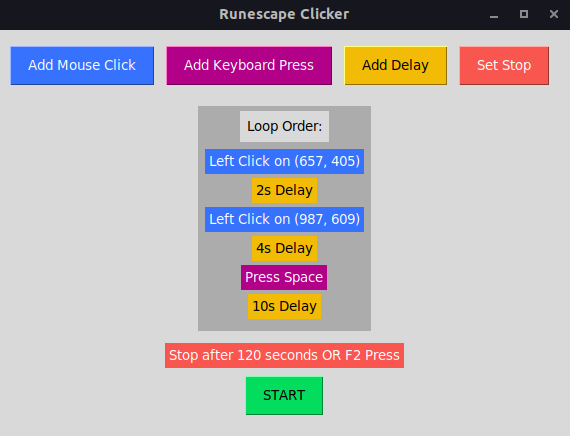

# Runescape Clicker

An open source Runescape Clicker with graphical interface developed in Python.



## Features

- Left or Right Click on desired position
- Keyboard Press (1, 2, 3, Space)
- Set Delay
- Set automatic stop after x seconds

## Tech

- Python3
- Required Pip Packages:
  - tkinter
  - pynput
  - bindglobal

## Usage

1. Download the .zip for [Windows](https://github.com/matheustalves/RunescapeClicker/releases/download/v1.0.0/windows-app.zip) or [Linux](https://github.com/matheustalves/RunescapeClicker/releases/download/v1.0.0/linux-app.zip)
2. Extract it and launch the app executable.

- #### From Source

1. Make sure you have Python 3 and all the project dependencies installed.
2. Extract the files and execute  ```python3 src/app.py``` on the main directory.